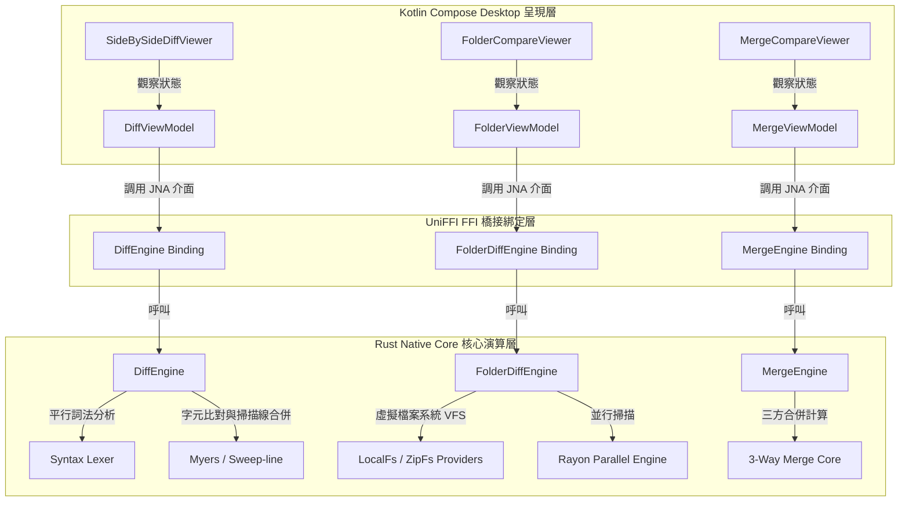

# BeyondDiff (theCompare) 程式碼庫說明文件 (Codebase Explanation Guide)

本文件旨在為開發人員提供 **BeyondDiff (theCompare)** 專案的全面程式碼庫解讀。本專案為一個高效能、跨平台的雙欄代碼比對（Side-by-Side Diff）、目錄比對與同步（Folder Compare & Sync）、以及三方合併（3-Way Merge）工具，採用 **Kotlin Compose Multiplatform** 作為前端 UI 呈現，並結合 **Rust 核心引擎** 以提供極致的計算速度與效能。

---

## 1. 系統架構總覽 (System Architecture Overview)

BeyondDiff 採用典型的 **MVVM (Model-View-ViewModel)** 模式，並透過 **UniFFI** 進行跨語言（Kotlin-Rust）綁定，其核心設計哲學在於 **UI 呈現與演算核心完全解耦**：

1. **View (UI 呈現層)**：使用 Kotlin Compose Multiplatform (Desktop) 實作。負責高水準的 UI 元件渲染、主動感知滾動與手勢事件，並提供極佳的深色模式現代美學。
2. **ViewModel (狀態管理與橋接層)**：用以管理應用程式的即時狀態（如載入路徑、是否修改未存、Undo/Redo 歷史堆疊）。透過協程以非同步方式呼叫 Rust 模組。
3. **Model & Engine (Rust 演算核心層)**：利用 Rust 強大的 CPU 密集計算與安全記憶體管理能力，實作 Myers 與 Patience (SimpleLinear) 比對演算法、平行化的文件高亮分詞、高效掃描線（Sweep-line）區間交織，以及基於 Rayon 的並行虛擬檔案系統目錄樹掃描。



---

## 2. 專案目錄結構 (Directory Tree Layout)

程式碼工作區的實體布局結構如下：

```
theCompare/
├── Documents/                          # 架構設計與整合技術指南文件
│   ├── architecture_design.md          # 雙欄比對視圖架構設計
│   ├── codebase_explanation.md         # [本文件] 程式碼庫完整說明
│   ├── git_integration_guide.md        # Git 整合與 CLI 包裝器設定
│   ├── large_file_optimization_guide.md# 大檔加載、分頁及掃描線優化設計
│   ├── release_setup.md                # 各平台自動化拷貝打包與 CI/CD 工作流
│   └── wasm_plugin_architecture.md     # WebAssembly 外掛沙箱架構設計與擴充
├── src/                                # Kotlin 原始碼目錄
│   └── main/
│       ├── kotlin/
│       │   ├── Main.kt                 # 應用程式進入點，主視窗及三大 ViewModel/View 實作
│       │   └── bindings/               # UniFFI 自動產生的 Kotlin 橋接程式碼
│       │       └── uniffi/
│       │           └── compare_core/
│       │               └── compare_core.kt
│       └── resources/                  # 供打包的平台專屬動態庫資源目錄
│           ├── win32-x86-64/           # 放 Windows dll
│           ├── darwin-aarch64/         # 放 macOS ARM dylib
│           ├── darwin-x86-64/          # 放 macOS Intel dylib
│           └── linux-x86-64/           # 放 Linux so
├── rust_core/                          # Rust 原始碼與編譯設定
│   ├── Cargo.toml                      # 套件依賴管理（clap, rayon, zip, encoding_rs 等）
│   ├── build.rs                        # UniFFI 腳本編譯設定
│   └── src/
│       ├── lib.rs                      # FFI 進入點、Diff 引擎、VFS 目錄樹比對、3-way 合併邏輯
│       ├── wasm_plugin.rs              # Wasmtime 沙箱外掛載入器實作
│       └── bin/
│           └── my-diff.rs              # CLI 包裝器原始碼，用以銜接 Git difftool/mergetool
├── test_data/                          # 測試資料夾，放比對測試用文字檔 (base, local, remote 等)
├── plugins/                            # Wasm 轉換插件二進位檔存放目錄 (.wasm)
├── build.gradle.kts                    # Gradle JVM 及 Compose 打包腳本（含 copyRustLib 自動同步）
├── settings.gradle.kts                 # Gradle 多模組及 repository 設定
├── compare_core.dll                    # 本地編譯之 Windows Rust 動態庫快取
├── my-diff.exe                         # 本地編譯之 CLI 包裝器快取
├── gradlew & gradlew.bat               # Gradle 啟動包裝器
└── Cargo.lock                          # Rust 依賴版本鎖定檔
```

---

## 3. Rust 核心模組與演算法解析 (Rust Core & Algorithms)

所有高效能計算模組皆實作於 [`rust_core/src/lib.rs`](file:///c:/Users/mesme/workspace/theCompare/rust_core/src/lib.rs)。以下依功能詳細拆解：

### 3.1 雙比對演算法與策略模式 (DiffStrategy)
Rust 端透過一個定義好的 `DiffStrategy` 策略特徵（Trait）來將比對演算法模組化：
```rust
pub trait DiffStrategy: Send + Sync {
    fn compare(&self, old_text: &str, new_text: &str) -> Vec<DiffLine>;
}
```
* **Myers 演算法 (`MyersAlgorithm`)**：
  - 核心函數 `diff<T: PartialEq>(a: &[T], b: &[T])` 實作了經典的 Myers 貪婪演算法（SES，最短編輯序列），時間複雜度為 $O(ND)$，此處將每行轉換為一個經由 `lines_to_ids` 對映的雜湊整數 `u32`，大幅減少字串比對開銷。
* **SimpleLinear (Patience) 演算法 (`SimpleLinearAlgorithm`)**：
  - 實作了基於行的快速線性比對策略，適用於大檔案的極速排版比對。

### 3.2 高效自訂分詞器 (Custom Lexer)
為確保比對的程式碼具有語法高亮，Rust 實作了手寫的高效詞法分析器 `tokenize_line`，能將一行程式碼切分為多個 `TokenSpan`（識別為關鍵字 `Keyword`、注釋 `Comment`、字串 `String`、數字 `Number` 或一般代碼 `Normal`）。
- **關鍵字識別**：預置了諸如 `class`, `fun`, `val`, `rust`, `impl` 等多語言關鍵字陣列。
- **並行加速**：在 `compare` 階段，會使用 `std::thread::spawn` 分別為舊檔案和新檔案開啟獨立的背景執行緒並行跑分詞，使 CPU 多核心效能得以充分發揮，減半加載時間。

### 3.3 掃描線交織演算法 (Sweep-line Span Intersection)
當偵測到一列資料為修改狀態（`LineStatus::MODIFIED`）時，系統不僅需要標示出行層級的變更，還需要呈現「字元層級」的細部異動（Myers SES 計算），同時又不能覆蓋 Lexer 計算出的語法色彩。
- `merge_spans` 實作了線性時間複雜度 $O(N + M)$ 的掃描線算法，移動兩個指標分別遍歷 `diff_spans` 與 `token_spans`。
- 在字元重疊處，合併產生新的 `TextSpan`，將變更狀態（`is_changed`）與語法型態（`token_type`）交織在一起，送回 Kotlin 進行精準渲染。

### 3.4 核心引擎與分頁快取 (DiffEngine)
為解決 JVM-Rust 跨邊界傳輸大檔案時產生的高度記憶體序列化開銷：
1. Kotlin 呼叫 `compare_files(path_a, path_b)`。
2. Rust 讀取檔案，執行並行 Lexer 與 Myers 比對，將計算結果 `Vec<DiffLine>` 快取在 `DiffEngine` 的 `cached_lines: Mutex<Option<...>>` 中，僅將**總行數**（如 50,000）返回給 Kotlin。
3. Kotlin 初始化 50,000 個 `null` 佔位符。
4. 當 UI 滾動時，Compose 透過 `get_lines_page(start, count)` 每次僅載入 100 行（分頁大小），極大節省了 JNA 的傳輸延遲與記憶體波動（保證記憶體持續低於 50MB）。

### 3.5 虛擬檔案系統 (VFS) 與資料夾並行比對
為支援雲端壓縮檔或多種媒介，專案設計了虛擬檔案系統抽象介面 `VfsProvider`：
```rust
pub trait VfsProvider: Send + Sync {
    fn list_directory(&self, path: String) -> Result<Vec<VfsNode>, VfsError>;
    fn read_file_content(&self, path: String) -> Result<Vec<u8>, VfsError>;
}
```
* **實作**：
  - `LocalFsProvider`：呼叫系統標準 I/O 遍歷本機磁碟。
  - `ZipFsProvider`：利用 `zip` 庫在記憶體中解壓縮並樹狀列出 ZIP 包內容。
* **並行目錄掃描**：
  - `compare_directories_parallel` 利用 `rayon` 的 `rayon::join` 與並行迭代器 `par_iter` 同時向下遞迴，快速產出帶層級（`level`）與比對狀態（`FolderDiffStatus`：未變更、已修改、左側孤立、右側孤立）的扁平結構 `FolderDiffRow`。

### 3.6 三方合併模組 (MergeEngine)
`MergeEngine` 是 3-Way Merge 的大腦：
- 核心算法為 `run_3way_merge(base, local, remote)`。
- 它利用 `base` (共同祖先) 對 `local` 及 `remote` 各跑一次 Myers Diff。
- 分析出哪些行是被兩側同時修改、一側修改一側刪除、或兩側同時插入。
- 對於衝突區塊（Conflict），會自動生成標準的 Git 衝突標記：
  ```
  <<<<<<< LOCAL
  ...
  =======
  ...
  >>>>>>> REMOTE
  ```
  並封裝於 `MergeRow` 提供給 UI，允許使用者互動解決。

### 3.7 WebAssembly 外掛沙箱 (`wasm_plugin.rs`)
雖然此功能尚在規劃或外掛擴充階段，但本專案已在 Rust 端引入 `wasmtime`：
- `WasmPlugin` 可以讀入 `.wasm` 模組，並透過沙箱內存（`alloc`, `dealloc`）傳遞二進位緩衝區（如 Excel 或 PDF 的 raw byte）。
- 執行內置的 Wasm 轉換函數 `transform` 將其轉換成純文字 CSV / TXT，藉以在主引擎中對非文字格式進行比對。

---

## 4. Kotlin 介面與 MVVM 架構解析 (Compose Frontend)

UI 與狀態流轉實作於 [`src/main/kotlin/Main.kt`](file:///c:/Users/mesme/workspace/theCompare/src/main/kotlin/Main.kt)。

### 4.1 UI 與 Core 的資料對齊合約
在 `Main.kt` 最上方，定義了與 Rust 對接的鏡像列舉與資料結構：
* `LineStatus` 對照 Rust 的 `DiffStatus`（新增、刪除、修改、未變更、無關緊要）。
* `DiffRowData` 承載單行文字、行號、高亮區間 `TextSpan`。
* `MoveBlock` 表示某個變更區塊（包含左右行號範圍），用以渲染連線與執行點擊合併。

### 4.2 三大 ViewModel 的職責
* **`DiffViewModel`**：
  - 維護 `diffLines: List<DiffRowData?>`（含有 `null` 佔位符的延遲加載串列）。
  - 維護 `undoStack` 與 `redoStack`（記錄為 `HistoryState` 物件，保存暫存檔內容），支援完整的**編輯復原與重做**功能。
  - 當用戶點擊合併時，執行 `mergeBlock`，直接修改本機暫存檔，並通知 Rust 重新比對以重繪 UI。
* **`FolderViewModel`**：
  - 調用 Rust 的並行目錄掃描，並透過 `collapsedPaths` 控制樹狀資料夾折疊邏輯。
* **`MergeViewModel`**：
  - 串接 `MergeEngine`，管理四面板合併狀態，當衝突被解決（點擊 Local / Remote 保留）或使用者直接編輯時，調用 `updateMergedLine` 實時更新合併輸出。

### 4.3 UI 重點最佳化元件
* **完美同步滾動（Single LazyColumn）**：
  - 核心組件 `SideBySideDiffViewer` 放棄了「左右兩個獨立 LazyColumn + 監聽滾動同步」的傳統高延遲做法。
  - 改用 **單一個 `LazyColumn`**，在 `DiffRowView` 中同時橫向排版左半欄與右半欄。這保證了 100% 的物理對齊，完全不會出現錯位或同步 lag，即使幾萬行依然能維持極佳幀率。
* **高度自適應與 Hatch 斜線背景**：
  - 使用 `Row(modifier = Modifier.height(IntrinsicSize.Min))` 強制子視圖高度等同於最長的一邊，解決了換行時高度不一的問題。
  - 使用 `hatchBackground()` 以 Canvas 動態繪製微透明的斜線陰影（Hatch Pattern），明確標示出不存在的對稱行。
* **變更小地圖 (OverviewMap)**：
  - 以 Canvas 手繪縮圖。讀取整個 `diffLines` 的狀態，用極細的紅/灰線將整個檔案的修改狀況投影在最左側。
  - 支援觸控與滑鼠拖曳點擊，能非同步 `scrollToItem` 直接跳轉到該程式碼區塊。
* **互動連線與手勢合併層 (MoveAlignmentOverlay)**：
  - 此元件作為 overlay 疊加在程式碼之上。
  - 使用自訂 Canvas 動態追蹤目前畫面中可見 `MoveBlock` 的頂部與底部 Y 軸座標。
  - 在畫面中線渲染左右箭頭按鈕（`►` 與 `◄`），當滑鼠懸停（Hover）時發出動態縮放圓圈高亮，點擊即可非同步觸發 `mergeBlock`，提供流暢的「一鍵採納變更」體驗。
* **語法高亮 AnnotatedText 合成**：
  - `buildAnnotatedText` 讀取 `inlineChanges`，在背景符合條件時，對 `LineStatus::MODIFIED` 且 `isChanged == true` 的字元標註深紅粗體（紅底白字高對比效果），使變更在視覺上極為顯眼。

---

## 5. CLI 與 Git 整合機制 (CLI Tool Design)

CLI 包裝器實作於 [`rust_core/src/bin/my-diff.rs`](file:///c:/Users/mesme/workspace/theCompare/rust_core/src/bin/my-diff.rs)：
- **命令列分析**：使用 `clap` 套件。
  - `my-diff <file_a> <file_b>`：直接帶參數開啟雙欄比對視窗。
  - `my-diff --merge <local> <remote> <base> <output>`：開啟 3-Way 衝突合併視窗。
- **UI 呼叫引導**：
  - 在開發期（`gradlew.bat` 存在時），它會跑 `gradlew.bat run --args="..."` 引導 JVM 啟動 Compose UI。
  - 在正式發布期，它會直接在同目錄下執行編譯打包好的 `theCompare.exe`。
- **Exit Code 設計**：
  - 當 Compose GUI 關閉時，Java 會向作業系統返回執行結果（0 代表正常結束無衝突且已儲存，1 代表尚有衝突或使用者取消）。
  - `my-diff.rs` 捕獲此狀態，並精準將 exit code 映射給 Git（若回傳 0，Git 就會將該衝突標記為已解決；若為 1 則中斷並保留衝突），完美相容於 `git mergetool` 流程。

---

## 6. 自動化編譯、打包與 CI/CD (Build & Deployment)

專案提供了流暢的多平台打包架構，確保 Java + Rust 的混血專案可以輕鬆發布：

### 6.1 Gradle 自動同步拷貝 (build.gradle.kts)
專案配置了自訂任務 `copyRustLib`：
1. 偵測目前執行的 OS（Windows, macOS 或 Linux）。
2. 在 `processResources` 執行前，自動拷貝編譯好的 Rust 動態庫檔（`.dll`, `.dylib`, `.so`）至 `src/main/resources/<platform-arch>` 中。
3. **運作時載入**：UniFFI 採用的 JNA 載入器會在 JVM 執行時，自動依據平台從資源包（JAR）中解壓對應的動態庫，無需手動配置 `java.library.path`。

### 6.2 跨平台 CI/CD 流水線 (.github/workflows/release.yml)
基於 GitHub Actions，當開發者推送 `v*` 的 Git Tag 時：
- **Matrix 矩陣建置**：同時啟動 `windows-latest`、`macos-latest`、`ubuntu-latest` 三台虛擬機。
- **流程**：
  1. 安裝 JDK 17 與 stable Rust 工具鏈。
  2. 編譯 Rust 核心層（`cargo build --release`）。
  3. 透過 `uniffi-bindgen` 產生最新的 Kotlin 綁定檔案。
  4. 執行 `./gradlew package<Format>`（產生 MSI, DMG, DEB）。
  5. 自動上傳至 GitHub Release，實現一鍵式全平台自動化打包。

---

## 7. 開發指引與延伸思考 (Developer Guide)

1. **擴充比對演算法**：
   若想實作其他的比對演算法（如 Histogram Diff），僅需在 Rust 端新增一個結構體並實作 `DiffStrategy` Trait，然後在 `DiffEngine::set_algorithm` 進行對照即可，Kotlin UI 完全不需修改。
2. **非同步安全**：
   在 Compose 中呼叫任何可能執行 Rust 計算或進行磁碟讀寫的 FFI 綁定函數時，務必封裝在協程的 `withContext(Dispatchers.IO)` 中，防止 Rust 的 CPU 密集運算阻塞 JVM GUI 主執行緒，確保 60+ FPS 的滑順操控感。
3. **擴充新檔案預處理 (Wasm Sandbox)**：
   只需將預處理後的 text 結果輸出給 Rust `compare_files` 使用，即可輕鬆支援 Word、Excel 或 PDF 等豐富的格式比對。
