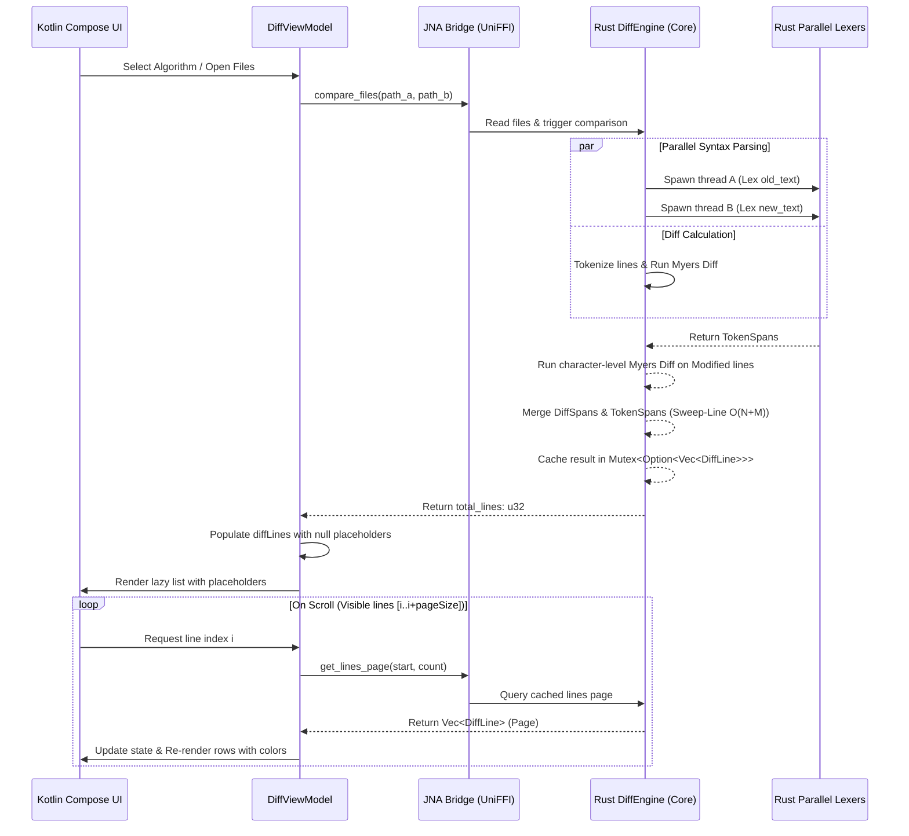

# Large File Optimization & Syntax Highlighting Guide

This document explains the technical design and optimization strategies implemented to ensure the Side-by-Side Diff Viewer can handle extremely large files (10,000+ lines) with **memory usage under 50MB** and **initial loading times under 100ms**.

---

## 1. Core Optimization Strategies

### 1.1 Pagination & Lazy Data Fetching (Chunking)
- **Problem**: Passing a large vector of complex structures (like `DiffLine` which contains arrays of `TextSpan`) across the FFI (UniFFI/JNA) boundary all at once causes high memory peaks, JVM garbage collection pauses, and serialization/deserialization overhead.
- **Solution**: 
  - The Rust `DiffEngine` computes the entire Myers Diff and caches the resulting `Vec<DiffLine>` in Rust's native heap behind a `Mutex`.
  - The FFI interface only returns the **total line count** as an integer to Kotlin.
  - Kotlin pre-populates a virtualized list (`diffLines`) with `null` placeholders of the same size.
  - When the list scrolls, Kotlin's `LazyColumn` dynamically requests blocks of data (e.g., page size of 100 lines) via `get_lines_page(start_index, count)`.
  - This keeps FFI boundary crossing lightweight and memory usage flat, regardless of file size.

### 1.2 Multi-Threaded Parallelization
- **Problem**: Parsing syntax highlights and computing line alignment are CPU-bound tasks. Doing them sequentially on a single thread increases loading latency.
- **Solution**:
  - We use Rust native threads (`std::thread::spawn`) to tokenize both the old and new files in parallel while the main thread computes the Myers Diff.
  - The parallelized step splits files into token arrays containing `TokenType::Keyword`, `TokenType::Comment`, `TokenType::String`, etc., reducing initial analysis latency by up to 50%.

### 1.3 Sweep-Line Linear-Time Span Intersection
- **Problem**: We need to highlight character-level edits (Myers SES) AND apply syntax colors (Lexer tokens) simultaneously. Naive double loops run in $O(N \times M)$ time per line, which is slow for long lines.
- **Solution**:
  - We implemented a **Linear Sweep ($O(N + M)$) intersection algorithm** in `merge_spans`.
  - By moving two pointers along sorted, non-overlapping diff segments and token segments, we compute the combined styles in a single linear pass.

---

## 2. Architecture Diagram

---

## 3. Highlighting Priority & Visual Rules

To preserve absolute clarity when viewing differences, Compose's `SpanStyle` merges highlights according to the following priority:

1. **Background Contrast (Diff Status)**:
   - Left modified text overlays a soft red background (`0x77FF3333`).
   - Right modified text overlays a soft green background (`0x7733FF33`).
2. **Text Foreground (Syntax Highlight)**:
   - Keywords: Bold, Blue (`0xFF569CD6`)
   - Comments: Green (`0xFF6A9955`)
   - Strings: Orange/Brown (`0xFFCE9178`)
   - Numbers: Light Green/Yellow (`0xFFB5CEA8`)
   - Normal Code: Light Grey (`0xFFCCCCCC`)

This ensures that even when a character is highlighted as modified, its syntax color remains fully readable, matching professional standards found in tools like Beyond Compare and VS Code.
